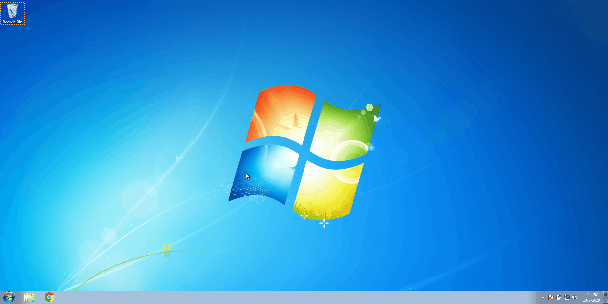

# Developer SDK Installer
* **Objective**: The purpose of this repository to is to provide a homogenous development environment among a development team

## Demonstration

### Windows SDK Installer
* This project contains a `.bat` file which will install the following windows dependencies:
    * Python
    * Node.js
    * Notepad++
    * Awesomium
    * Markdown Pad
    * Visual Studio Code
    * IntelliJ Community Edition
    * PyCharm Community Edition
    
#### Automated installer
* Download this project as a `.zip`
* Execute the respective installer for your environment

### MacOS SDK Installer

* This project contains a `.sh` file which will install the following windows dependencies:
    * HomeBrew
    * Git Cli
    * Python
    * Node.js
    * Visual Studio Code
    * IntelliJ Community Edition
    * PyCharm Community Edition
    
#### Automated installer
* Download this project as a `.zip`
* Execute the respective installer for your environment
